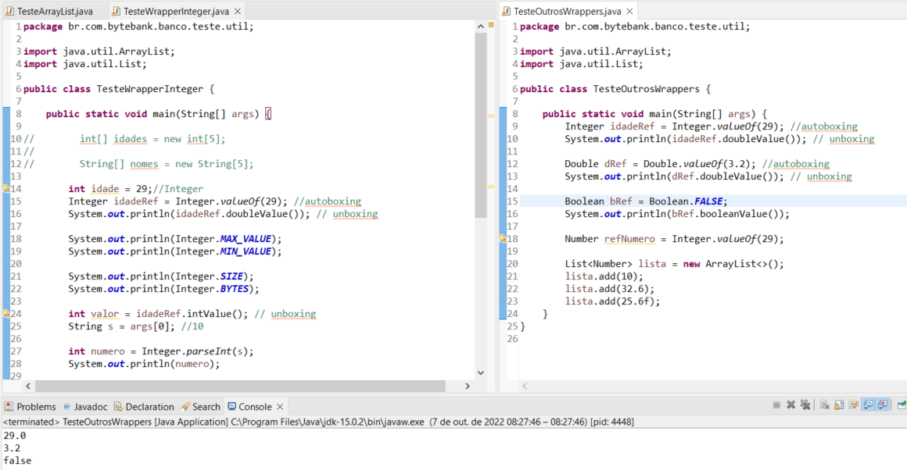

## Curso de Java e java.util: Coleções, Wrappers e Lambda expressions

**Faça esse curso de Java e:**

- Aprenda os fundamentos das coleções Java.

- Explore o poder e flexibilidade das listas.

- Saiba trabalhar com ArrayList, LinkdedList ou Vector.

- Entenda como funcionam as lambda expressions.

- Manipule e ordene as coleções.

**Instrutor:**
[Nico Steppat](https://github.com/steppat)

### 01. Conhecendo Arrays

**Nessa aula sobre Arrays aprendemos:**

- Um array é uma estrutura de dados e serve para guardar elementos (valores primitivos ou referências)

- Arrays usam colchetes (**[]**) sintaticamente

- Arrays têm um tamanho fixo!

- Um array também é um objeto!

- Arrays são zero-based (o primeiro elemento se encontra na posição **0**)

- Um array é sempre inicializado com os valores padrões.

- Ao acessar uma posição inválida recebemos a exceção **ArrayIndexOutOfBoundException**

- Arrays possuem um atributo **length** para saber o tamanho

- A forma literal de criar uma Array, com o uso de chaves **{}**.

No próximo capítulo falaremos mais um pouco sobre arrays (do tipo Object) e veremos como funciona esse parâmetro do método **main**.

**Arrays**

### 02. Guardando qualquer referência

**args**

**Nessa aula aprendemos:**

- uma array do tipo **Object** pode guardar qualquer tipo de referência

- quando convertemos uma referência genérica para uma referência mais específica é preciso usar um ***type cast***

- o cast só compila quando é possível, mesmo assim pode falhar na hora de rodar

- quando o type cast falha podemos receber uma **ClassCastException**

- para receber valores ao chamar o programa Java na linha de comando podemos usar o array **String[]** no método main

Na próxima aula começaremos a falar sobre listas! 

### 03. ArrayList e Generics

O que aprendemos?

Nessa aula começamos a falar sobre lista e conhecemos a classe **java.util.ArrayList**. Aprendemos:

- que a classe **java.util.ArrayList** encapsula o uso do array e oferece vários métodos de mais alto nível

- que uma lista guarda referencias

- como usar métodos **size**, **get**, **remove**

- como usar o **foreach** para iterar a **ArrayList**

- que os generics parametrizam classes

- que no caso da **ArrayList** podemos definir o tipo dos elementos através de generics

Isso é apenas o início sobre esse poderoso pacote **java.util**. Na próxima aula vamos mergulhar mais!

### 04. Equals e mais listas

**O que aprendemos?**

Nessa aula aprendemos:

- como implementar o método **equals** para definir a igualdade

- que o método **equals** é utilizado pelas listas

- que existe mais uma lista, a **java.util.LinkedList**

- a diferença entre **ArrayList** e **LinkedList**

- a interface **java.util.List** que define os métodos da lista

No próximo capítulo veremos mais uma implementação da interface List

### 05. Vector e a Interface Collection

**Nessa aula vimos:**

- o **java.util.Vector**, que é uma ***ArrayList*** thread safe

- a interface **java.util.Collection** que é a interface de todas as coleções

- as listas são sequencias que aceitam elementos duplicados

- os conjuntos (**java.util.Set**) também são coleções, mas não aceitam duplicados nem são listas

Na próxima aula vamos resolver o problema de guardar primitivos nas listas!

### 06. As classes Wrappers

**Nessa aula focamos nas classes WRAPPERS e aprendemos que**

- para cada primitivo existe uma classe chamada Wrapper

- para guardar um primitivo numa coleção é preciso criar um objeto que embrulha o valor

- a criação do objeto Wrapper é chamada de autoboxing

- a retirada do valor primitivo do objeto Wrapper é chamada de unboxing

- autoboxing e unboxing acontecem automaticamente.

- as classes wrapper possuem vários métodos auxiliares, por exemplo para o parsing

- todas as classes wrappers que representam um valor numérico possuem a classe **java.lang.Number** como mãe

Na próxima aula vamos aprender como ordenar as listas!

### 07. Ordenação de listas

